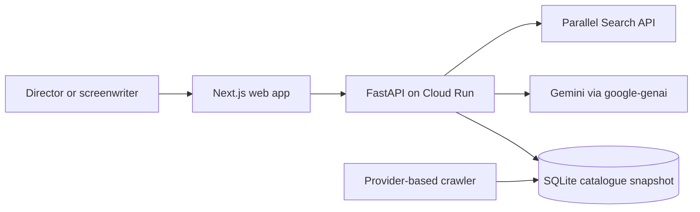

# StageSight architecture

StageSight runs as three processes:

The web app provides catalogue search, screenplay matching and camera/light previews. The API validates that recommendations refer to real catalogue records and labels AI images as illustrative. Parallel searches public filming rules on demand and returns the retrieved sources; Gemini only summarizes the supplied evidence.

The catalogue is assembled locally from enabled Korean providers. The Cloud Run image contains a read-only snapshot, so refreshing production data requires a crawler run followed by redeployment.

The agent flow is a custom Python orchestrator. Gemini handles text interpretation and image editing; optics, solar calculations and catalogue filtering remain deterministic Python functions. The project does not claim a Google ADK or Vertex AI runtime.
